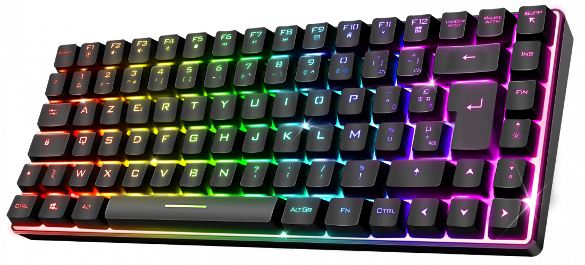

= My Keyboard

A example project to generate an SVG keyboard. 
Illustration with my keyboard (<<elite>>) with https://github.com/oliviercailloux/frsci/[my layout].

.ELITE-K70
[#elite,link=https://spiritofgamer.com/fr/claviers/402-elite-k70rf-3700104445956.html]

== Instructions

- Created Elite K70.json manually
- Rectangular.java yields Rectangular Elite K70 unlabeled.svg.
- Manual modification yields Elite K70 unlabeled.svg.

X key names styled

- XKeyNamed.java yields Elite K70 with X key names.svg.
- Manual modification yields Elite K70 with X key names styled.svg.

French mapping styled
- French.java yields Elite K70 French.svg.
- Manual modification yields Elite K70 French styled.svg.
